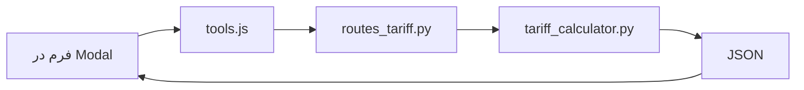

# Project Map: صدرافارس | پورتال مهندسی و ساختمان

## 🧭 معماری کلی


## 📁 ساختار فولدرها
```
/ (root)
├── app/
│   ├── main.py
│   ├── api/routes_tariff.py
│   ├── models/tariff_models.py
│   └── services/tariff_calculator.py
├── static/
│   ├── js/
│   │   ├── tools.js
│   │   └── modal.js
│   └── css/style.css
├── templates/index.html
└── (مراجع: eng.md, surv.md)
```

## 🧮 منطق محاسبات

### 1. نقشه‌برداری (با مالیات ۱۰%)

| ردیف | خدمات | نحوه محاسبه | حداقل |
|------|-------|-------------|-------|
| 1-1 | مساحی عرصه | پلکانی (تا ۵۰۰ مقطوع، مازاد نرخ‌های کاهشی) | ۵۰۰ متر |
| 2-1 | UTM | مقطوع تجمعی (تا ۱۰۰۰، تا ۵۰۰۰، تا ۱۰۰۰۰) | ۵۰۰ متر |
| 2 | میخکوبی | پلکانی تجمعی (۸ نقطه پایه، مازاد با ضرایب) | ۸ نقطه |
| 3-1+2 | تک خطی قابل دریافت | نرخ ثابت × متراژ (۱۲۵,۷۱۳ + ۹۸,۷۷۴) | ۵۰۰ متر |
| 3-4 | تفکیکی دارای سابقه | نرخ ثابت × متراژ (۵۳,۸۷۱) | ۵۰۰ متر |
| 3-1+4 | تفکیکی فاقد سابقه | نرخ ثابت × متراژ (۱۲۵,۷۱۳ + ۵۳,۸۷۱) | ۵۰۰ متر |
| 5 | توپوگرافی | پلکانی تجمعی (تا ۵۰۰ مقطوع، مازاد نرخ‌های کاهشی) | ۵۰۰ متر |
| 6 | نقشه بلوک شهری | پلکانی (تا ۲۰۰ مقطوع، مازاد نرخ ثابت) | - |
| 7 | پروفیل طولی و عرضی | نرخ ثابت × طول کیلومتر (۶۲,۸۵۵,۵۱۰) | ۱ کیلومتر |
| 8 | مقاطع طولی | نرخ ثابت × طول کیلومتر (۵۳,۸۷۶,۱۵۰) | ۱ کیلومتر |
| 9 | مناطق خاص | نرخ ثابت × متراژ (۳۹,۵۱۰) با حداقل | حداقل ۸۰,۸۱۴,۲۲۳ |
| 10 | کنترل قائم ستون‌ها | نرخ ثابت × تعداد ستون (۶,۲۸۵,۵۵۵) + اضافه ارتفاع | ۴ ستون |

### 2. خدمات مهندسی (بدون مالیات)
- **گروه‌بندی:** ۷ گروه بر اساس تعداد طبقات
- **فرمول:** `هزینه = متراژ × نرخ گروه`
- **نقشه‌بردار:** خودکار (فقط ب، ج، د)

#### نرخ‌ها (ریال به ازای هر مترمربع)
| گروه | طبقات | طراحی | نظارت | نقشه‌برداری |
|------|-------|--------|--------|-------------|
| الف | ۱-۲ | 2,892,000 | 3,534,000 | 0 |
| ب | ۳-۵ | 3,680,000 | 4,498,000 | 587,000 |
| ج۱ | ۶-۷ | 4,154,000 | 5,077,000 | 628,000 |
| ج۲ | ۸-۱۰ | 4,732,000 | 5,783,000 | 642,000 |
| د۱ | ۱۱-۱۲ | 5,783,000 | 7,069,000 | 681,000 |
| د۲ | ۱۳-۱۵ | 6,835,000 | 8,354,000 | 696,000 |
| د۳ | ۱۶+ | 6,835,000 | 8,354,000 | 773,000 |

## 🔗 Endpoints (`/tariff`)

**نقشه‌برداری:** `/land_survey`, `/utm`, `/staking`, `/single_line_receivable`, `/subdivision_with_history`, `/subdivision_without_history`, `/topography`

**مهندسی:** `/engineering/design`, `/engineering/supervision`, `/engineering/all`

## 🎨 فرانت‌اند (tools.js)
- `SERVICE_CONFIG` + `ENGINEERING_CONFIG` – تعریف سرویس‌ها
- `displayResult()` – نمایش معمولی
- `displayEngineeringAllResult()` – نمایش مخصوص `/all`
- نقشه‌برداری خودکار است (کاربر انتخاب نمی‌کند)

## ⚠️ نکات سریع
- حداقل متراژ نقشه‌برداری: ۵۰۰ متر
- کش مرورگر: `?v={{ timestamp }}`
- مراجع داده: `eng.md`, `surv.md`
