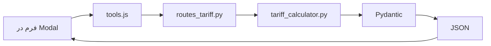

# Project Map: صدرافارس | پورتال تخصصی مهندسی و ساختمان

## 🧭 نمای کلی (TL;DR)
یک API FastAPI برای محاسبه تعرفه‌های نقشه‌برداری و خدمات مهندسی ساختمان (سال ۱۴۰۵) با frontend ساده. ورودی‌ها از طریق فرم دریافت، محاسبات روی Backend انجام و خروجی JSON برمی‌گردد.

## 📁 ساختار فولدرها (از ریشه)
```
/ (root)
├── app/
│   ├── main.py                 # ✅ فعال | FastAPI app، mount static، روت اصلی
│   ├── api/
│   │   └── routes_tariff.py    # ✅ فعال | تمام endpointهای محاسباتی (POST)
│   ├── models/
│   │   └── tariff_models.py    # ✅ فعال | Pydantic مدل‌های درخواست/پاسخ
│   └── services/
│       ├── tariff_calculator.py # ✅ فعال | منطق اصلی محاسبات (کلاس TariffCalculator)
│       ├── eng.md               # 📄 سند | داده‌های خام تعرفه مهندسی (مرجع)
│       └── surv.md              # 📄 سند | داده‌های خام تعرفه نقشه‌برداری (مرجع)
├── static/
│   ├── css/
│   │   └── style.css            # ✅ فعال | استایل‌های صفحه اصلی و مودال
│   ├── js/
│   │   ├── tools.js             # ✅ فعال | تعریف ابزارها، منطق مودال و فراخوانی API
│   │   └── modal.js             # ✅ فعال | کنترل باز/بستن مودال
│   └── images/
│       ├── favicon.png
│       └── bg.png
├── templates/
│   └── index.html               # ✅ فعال | صفحه اصلی (Hero, Tools Grid, News)
└── (سایر فایل‌ها: .gitignore, README, requirements.txt)
```

## 🧠 معماری جریان داده


## 🔗 Endpoints کلیدی (پایه `/tariff`)

### نقشه‌برداری (با مالیات ۱۰%)
| Endpoint | متد | توضیح |
|----------|------|-------|
| `/land_survey` | POST | مساحی عرصه (پلکانی) |
| `/utm` | POST | جانمایی (UTM) - مقطوع تجمعی |
| `/staking` | POST | میخکوبی (پلکانی تجمعی) |
| `/single_line_receivable` | POST | تک خطی قابل دریافت |
| `/subdivision_with_history` | POST | تفکیکی دارای سابقه |
| `/subdivision_without_history` | POST | تفکیکی فاقد سابقه |
| `/topography` | POST | توپوگرافی (پلکانی تجمعی) |
| `/urban_block_map` | POST | نقشه بلوک شهری |
| `/profile` | POST | پروفیل طولی و عرضی |
| `/longitudinal_section` | POST | مقاطع طولی |
| `/special_zone_map` | POST | نقشه مناطق ویژه |
| `/column_vertical_control` | POST | کنترل قائم ستون‌ها |

### خدمات مهندسی ساختمان (بدون مالیات)
| Endpoint | متد | توضیح |
|----------|------|-------|
| `/engineering/design` | POST | طراحی ساختمان (۴ رشته) |
| `/engineering/supervision` | POST | نظارت ساختمان (۴ رشته + نقشه‌برداری در صورت نیاز) |
| `/engineering/surveying` | POST | نقشه‌برداری ساختمان (به صورت مستقل) |
| `/engineering/all` | POST | مجموع طراحی+نظارت+نقشه‌برداری |

## 📦 مدل‌های ورودی (Pydantic - tariff_models.py)
| نام مدل | فیلدها | توضیح |
|---------|--------|-------|
| `AreaRequest` | `area_m2: float` | متراژ (مثبت) |
| `PointsRequest` | `num_points: int` | تعداد نقاط (مثبت) |
| `LengthRequest` | `length_km: float` | طول برحسب کیلومتر (مثبت) |
| `ColumnControlRequest` | `height_m: float, columns: int` | ارتفاع و تعداد ستون |
| `EngineeringRequest` | `area_m2, floors, include_surveying: bool` | مساحت، طبقات، آیا نقشه‌برداری مستقل محاسبه شود |
| `TariffResponse` | `base_amount, vat, total_amount, details: Optional[dict]` | خروجی یکسان برای همه |

## 🧮 منطق کلیدی (tariff_calculator.py)

### گروه‌بندی ساختمان (۷ گروه بر اساس تعداد طبقات)
| گروه | طبقات | کلید |
|------|-------|------|
| الف | ۱-۲ سقف | A |
| ب | ۳-۵ سقف | B |
| ج (۶-۷) | ۶-۷ سقف | C1 |
| ج (۸-۱۰) | ۸-۱۰ سقف | C2 |
| د (۱۱-۱۲) | ۱۱-۱۲ سقف | D1 |
| د (۱۳-۱۵) | ۱۳-۱۵ سقف | D2 |
| د (۱۶+) | ۱۶ سقف و بالاتر | D3 |

### نرخ‌های هر مترمربع (ریال) - خدمات مهندسی

#### طراحی (۴ رشته)
| گروه | نرخ (ریال/مترمربع) |
|------|-------------------|
| الف | ۲,۸۹۲,۰۰۰ |
| ب | ۳,۶۸۰,۰۰۰ |
| ج (۶-۷) | ۴,۱۵۴,۰۰۰ |
| ج (۸-۱۰) | ۴,۷۳۲,۰۰۰ |
| د (۱۱-۱۲) | ۵,۷۸۳,۰۰۰ |
| د (۱۳-۱۵) | ۶,۸۳۵,۰۰۰ |
| د (۱۶+) | ۶,۸۳۵,۰۰۰ |

#### نظارت (۴ رشته)
| گروه | نرخ (ریال/مترمربع) |
|------|-------------------|
| الف | ۳,۵۳۴,۰۰۰ |
| ب | ۴,۴۹۸,۰۰۰ |
| ج (۶-۷) | ۵,۰۷۷,۰۰۰ |
| ج (۸-۱۰) | ۵,۷۸۳,۰۰۰ |
| د (۱۱-۱۲) | ۷,۰۶۹,۰۰۰ |
| د (۱۳-۱۵) | ۸,۳۵۴,۰۰۰ |
| د (۱۶+) | ۸,۳۵۴,۰۰۰ |

#### نقشه‌برداری ساختمان (در صورت نیاز)
| گروه | نرخ (ریال/مترمربع) | توضیح |
|------|-------------------|--------|
| الف | ۰ | نیازی ندارد |
| ب | ۵۸۷,۰۰۰ | |
| ج (۶-۷) | ۶۲۸,۰۰۰ | |
| ج (۸-۱۰) | ۶۴۲,۰۰۰ | |
| د (۱۱-۱۲) | ۶۸۱,۰۰۰ | |
| د (۱۳-۱۵) | ۶۹۶,۰۰۰ | |
| د (۱۶+) | ۷۷۳,۰۰۰ | |

### فرمول‌های محاسباتی
```python
# طراحی
هزینه_طراحی = متراژ × نرخ_طراحی_گروه

# نظارت (شامل نقشه‌برداری در صورت نیاز)
هزینه_نظارت = متراژ × نرخ_نظارت_گروه + (متراژ × نرخ_نقشه‌برداری_گروه اگر > 0)

# مجموع کل
مجموع = هزینه_طراحی + هزینه_نظارت
```

### مالیات
- **نقشه‌برداری:** ۱۰% به تمام مبالغ پایه اضافه می‌شود
- **خدمات مهندسی ساختمان:** بدون مالیات

### حداقل متراژ در توابع نقشه‌برداری
- اکثر توابع نقشه‌برداری: حداقل ۵۰۰ متر مربع

## 🎨 سمت کاربر (Frontend)
| فایل | وظیفه |
|------|--------|
| `index.html` | صفحه اصلی، سه کارت ابزار، بخش اخبار |
| `style.css` | ریسپانسیو، مودال، انیمیشن، رنگ‌بندی |
| `modal.js` | کنترل باز/بستن مودال |
| `tools.js` | **قلب UI** – تعریف `SERVICE_CONFIG`، `ENGINEERING_CONFIG`، رندر فیلدها، ارسال fetch، نمایش نتیجه |

## ⚠️ نکات فنی برای توسعه/رفع اشکال
1. **نقشه‌برداری:** نرخ‌ها از `surv.pdf` استخراج شده و به صورت پلکانی/مقطوع محاسبه می‌شوند
2. **خدمات مهندسی:** 
   - گروه‌بندی بر اساس **تعداد طبقات** (۷ گروه)
   - **متراژ در نرخ تأثیری ندارد** (فقط برای ضرب نهایی استفاده می‌شود)
   - نقشه‌بردار فقط برای گروه‌های **ب، ج، د** و در کنار نظارت محاسبه می‌شود
3. **مودال داینامیک:** محتوای مودال از `tools.js` و تابع `openTool(tool)` تأمین می‌شود
4. **تاریخچه تازه‌سازی:** در `index.html` و `tools.js` از `?v={{ timestamp }}` برای جلوگیری از کش مرورگر استفاده شده
5. **مسیر فایل‌های استاتیک:** همه با پیشوند `/static/` و طبق `main.py` مونت شده‌اند
6. **CORS:** در `main.py` فعلاً تنظیم نشده (در صورت نیاز به فراخوانی از دامنه دیگر اضافه شود)

## 🗺️ وضعیت فایل‌ها (برای من)
- `✅ فعال` : فایل در چرخه اصلی استفاده می‌شود
- `📄 سند` : داده یا مرجع (تأثیر مستقیم در کد فعلی ندارد)

## 🧪 برای ادامه کار با من (مثلاً افزودن سرویس جدید)
اگر خواستی سرویس جدید اضافه کنی، این مسیر را طی می‌کنم:
1. مدل ورودی در `tariff_models.py`
2. متد محاسباتی در `tariff_calculator.py`
3. Endpoint در `routes_tariff.py`
4. تنظیمات در `tools.js` (`SERVICE_CONFIG` یا `ENGINEERING_CONFIG`)
5. در صورت نیاز، کارت جدید در `index.html`
