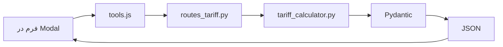

# Project Map: صدرافارس | پورتال تخصصی مهندسی و ساختمان

## 🧭 نمای کلی (TL;DR)
یک API FastAPI برای محاسبه تعرفه‌های نقشه‌برداری و خدمات مهندسی ساختمان (سال ۱۴۰۵) با frontend ساده. ورودی‌ها از طریق فرم دریافت، محاسبات روی Backend انجام و خروجی JSON برمی‌گردد.

## 📁 ساختار فولدرها (از ریشه)
```
/ (root)
├── app/
│   ├── main.py                 # ✅ فعال | FastAPI app، mount static، روت اصلی
│   ├── api/
│   │   └── routes_tariff.py    # ✅ فعال | تمام endpointهای محاسباتی (POST)
│   ├── models/
│   │   └── tariff_models.py    # ✅ فعال | Pydantic مدل‌های درخواست/پاسخ
│   └── services/
│       ├── tariff_calculator.py # ✅ فعال | منطق اصلی محاسبات (کلاس TariffCalculator)
│       ├── eng.md               # 📄 سند | داده‌های خام تعرفه مهندسی (مرجع)
│       └── surv.md              # 📄 سند | داده‌های خام تعرفه نقشه‌برداری (مرجع)
├── static/
│   ├── css/
│   │   └── style.css            # ✅ فعال | استایل‌های صفحه اصلی و مودال
│   ├── js/
│   │   ├── tools.js             # ✅ فعال | تعریف ابزارها، منطق مودال و فراخوانی API
│   │   └── modal.js             # ✅ فعال | کنترل باز/بستن مودال
│   └── images/
│       ├── favicon.png
│       └── bg.png
├── templates/
│   └── index.html               # ✅ فعال | صفحه اصلی (Hero, Tools Grid, News)
└── (سایر فایل‌ها: .gitignore, README, requirements.txt)
```

## 🧠 معماری جریان داده


## 🔗 Endpoints کلیدی (پایه `/tariff`)
| Endpoint | متد | توضیح |
|----------|------|-------|
| `/land_survey` | POST | مساحی عرصه |
| `/utm` | POST | جانمایی (UTM) |
| `/staking` | POST | میخکوبی |
| `/single_line_receivable` | POST | تک خطی قابل دریافت (فعال در UI) |
| `/subdivision_with_history` | POST | تفکیکی دارای سابقه (فعال در UI) |
| `/subdivision_without_history` | POST | تفکیکی فاقد سابقه (فعال در UI) |
| `/topography` | POST | توپوگرافی (فعال در UI) |
| `/engineering/design` | POST | طراحی ساختمان |
| `/engineering/supervision` | POST | نظارت ساختمان |
| `/engineering/surveying` | POST | نقشه‌برداری ساختمان (شرطی) |
| `/engineering/all` | POST | مجموع طراحی+نظارت+نقشه‌برداری |

## 📦 مدل‌های ورودی (Pydantic - tariff_models.py)
| نام مدل | فیلدها | توضیح |
|---------|--------|-------|
| `AreaRequest` | `area_m2: float` | متراژ (مثبت) |
| `PointsRequest` | `num_points: int` | تعداد نقاط (مثبت) |
| `LengthRequest` | `length_km: float` | طول برحسب کیلومتر (مثبت) |
| `ColumnControlRequest` | `height_m: float, columns: int` | ارتفاع و تعداد ستون |
| `EngineeringRequest` | `area_m2, floors, include_surveying: bool` | مساحت، طبقات، آیا نقشه‌برداری محاسبه شود |
| `TariffResponse` | `base_amount, vat, total_amount, details: Optional[dict]` | خروجی یکسان برای همه |

## 🧮 منطق کلیدی (tariff_calculator.py)
- **نقشه‌برداری:** نرخ‌ها فعلاً تقریبی/فرضی (نیاز به بازبینی با `surv.md`)
- **خدمات مهندسی:** گروه‌بندی بر اساس `(floors, area)` → گروه الف(۱-۲طبقه)، ب(۳-۵)، ج(۶-۷)، د(۸+)
- **نقشه‌برداری ساختمان:** شرط نیاز = `area > 600` و `group in ["ب","ج","د"]`
- **مالیات:** ۱۰% به تمام `base_amount` اضافه می‌شود
- **حداقل متراژ در اکثر توابع نقشه‌برداری:** ۵۰۰ متر مربع

## 🎨 سمت کاربر (Frontend)
| فایل | وظیفه |
|------|--------|
| `index.html` | صفحه اصلی، سه کارت ابزار، بخش اخبار |
| `style.css` | ریسپانسیو، مودال، انیمیشن، رنگ‌بندی |
| `modal.js` | کنترل باز/بستن مودال |
| `tools.js` | **قلب UI** – تعریف `SERVICE_CONFIG`، `ENGINEERING_CONFIG`، رندر فیلدها، ارسال fetch، نمایش نتیجه |

## ⚠️ نکات فنی برای توسعه/رفع اشکال
1. **نرخ‌های فرضی در نقشه‌برداری:** توابعی مثل `calculate_land_survey` از نرخ ثابت (`area * 157000`) استفاده می‌کنند، درحالی که فایل `surv.md` نرخ‌های پلکانی و دقیق دارد → نیاز به بازنویسی.
2. **مودال داینامیک:** محتوای مودال از `tools.js` و تابع `openTool(tool)` تأمین می‌شود، نه از فایل‌های HTML جدا.
3. **تاریخچه تازه‌سازی:** در `index.html` و `tools.js` از `?v={{ timestamp }}` برای جلوگیری از کش مرورگر استفاده شده.
4. **مسیر فایل‌های استاتیک:** همه با پیشوند `/static/` و طبق `main.py` مونت شده‌اند.
5. **CORS:** در `main.py` فعلاً تنظیم نشده (در صورت نیاز به فراخوانی از دامنه دیگر اضافه شود).

## 🗺️ وضعیت فایل‌ها (برای من)
- `✅ فعال` : فایل در چرخه اصلی استفاده می‌شود
- `📄 سند` : داده یا مرجع (تأثیر مستقیم در کد فعلی ندارد)
- `⚠️ نیاز به بازبینی` : کد دارد اما با مستندات هماهنگ نیست (مثل surv.md)

## 🧪 برای ادامه کار با من (مثلاً افزودن سرویس جدید)
اگر خواستی سرویس جدید اضافه کنی، این مسیر را طی می‌کنم:
1. مدل ورودی در `tariff_models.py`
2. متد محاسباتی در `tariff_calculator.py`
3. Endpoint در `routes_tariff.py`
4. تنظیمات در `tools.js` (`SERVICE_CONFIG` یا `ENGINEERING_CONFIG`)
5. در صورت نیاز، کارت جدید در `index.html`
