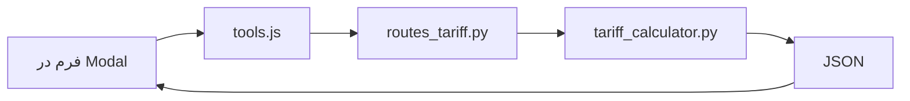

# Project Map: صدرافارس | پورتال مهندسی و ساختمان

## 🧭 معماری کلی


## 📁 ساختار فولدرها
```
/ (root)
├── app/
│   ├── main.py
│   ├── api/routes_tariff.py
│   ├── models/tariff_models.py
│   └── services/tariff_calculator.py
├── static/
│   ├── js/
│   │   ├── tools.js
│   │   └── modal.js
│   └── css/style.css
├── templates/index.html
└── references/
    ├── eng.xlsx
    └── surv.md
```

---

## 🧮 منطق محاسبات

### 1. نقشه‌برداری (با مالیات ۱۰%)

| ردیف | خدمات | نحوه محاسبه | حداقل |
|------|-------|-------------|-------|
| 1-1 | مساحی عرصه | پلکانی (تا ۵۰۰ مقطوع، مازاد نرخ‌های کاهشی) | ۵۰۰ متر |
| 2-1 | UTM | مقطوع تجمعی (تا ۱۰۰۰، تا ۵۰۰۰، تا ۱۰۰۰۰) | ۵۰۰ متر |
| 2 | میخکوبی | پلکانی تجمعی (۸ نقطه پایه، مازاد با ضرایب) | ۸ نقطه |
| 3-1+2 | تک خطی قابل دریافت | نرخ ثابت × متراژ (۱۲۵,۷۱۳ + ۹۸,۷۷۴) | ۵۰۰ متر |
| 3-4 | تفکیکی دارای سابقه | نرخ ثابت × متراژ (۵۳,۸۷۱) | ۵۰۰ متر |
| 3-1+4 | تفکیکی فاقد سابقه | نرخ ثابت × متراژ (۱۲۵,۷۱۳ + ۵۳,۸۷۱) | ۵۰۰ متر |
| 5 | توپوگرافی | پلکانی تجمعی (تا ۵۰۰ مقطوع، مازاد نرخ‌های کاهشی) | ۵۰۰ متر |
| 6 | نقشه بلوک شهری | پلکانی (تا ۲۰۰ مقطوع، مازاد نرخ ثابت) | - |
| 7 | پروفیل طولی و عرضی | نرخ ثابت × طول کیلومتر (۶۲,۸۵۵,۵۱۰) | ۱ کیلومتر |
| 8 | مقاطع طولی | نرخ ثابت × طول کیلومتر (۵۳,۸۷۶,۱۵۰) | ۱ کیلومتر |
| 9 | مناطق خاص | نرخ ثابت × متراژ (۳۹,۵۱۰) با حداقل | حداقل ۸۰,۸۱۴,۲۲۳ |
| 10 | کنترل قائم ستون‌ها | نرخ ثابت × تعداد ستون (۶,۲۸۵,۵۵۵) + اضافه ارتفاع | ۴ ستون |

---

### 2. خدمات مهندسی ساختمان (بدون مالیات)

#### 🔄 قوانین جدید (نسخه ۲)

##### ۲.۱ گروه‌بندی بر اساس تعداد سقف و متراژ

گروه پایه بر اساس **تعداد سقف** تعیین می‌شود، سپس بر اساس **متراژ** ارتقا می‌یابد:

| گروه پایه | تعداد سقف | شرط ارتقا | گروه پس از ارتقا |
|-----------|-----------|-----------|------------------|
| الف | ۱-۲ سقف | متراژ > ۶۰۰ | ب (۳-۵ سقف) |
| ب | ۳-۵ سقف | متراژ > ۲۰۰۰ | ج (۶-۷ سقف) |
| ج (۶-۷ سقف) | ۶-۷ سقف | متراژ > ۵۰۰۰ | ج (۸-۱۰ سقف) |
| ج (۸-۱۰ سقف) | ۸-۱۰ سقف | متراژ > ۵۰۰۰ | د (۱۱-۱۲ سقف) |
| د (۱۱-۱۲) | ۱۱-۱۲ سقف | - | - |
| د (۱۳-۱۵) | ۱۳-۱۵ سقف | - | - |
| د (۱۶+) | ۱۶+ سقف | - | - |

##### ۲.۲ نرخ‌های تفکیک شده هر رشته (ریال به ازای هر مترمربع)

**نرخ‌های طراحی (۴ رشته اصلی + هماهنگ کننده):**

| گروه | معماری | عمران | تاسیسات مکانیکی | تاسیسات برقی | هماهنگ کننده |
|------|--------|-------|-----------------|---------------|---------------|
| الف | 916,000 | 1,055,000 | 416,000 | 389,000 | 116,000 |
| ب | 1,119,000 | 1,294,000 | 559,000 | 524,000 | 184,000 |
| ج (۶-۷) | 1,210,000 | 1,406,000 | 664,000 | 625,000 | 249,000 |
| ج (۸-۱۰) | 1,379,000 | 1,601,000 | 756,000 | 712,000 | 284,000 |
| د (۱۱-۱۲) | 1,613,000 | 1,882,000 | 968,000 | 914,000 | 405,000 |
| د (۱۳-۱۵) | 1,907,000 | 2,225,000 | 1,144,000 | 1,081,000 | 478,000 |
| د (۱۶+) | 1,907,000 | 2,225,000 | 1,144,000 | 1,081,000 | 478,000 |

**نرخ‌های نظارت (۴ رشته اصلی + هماهنگ کننده):**

| گروه | معماری | عمران | تاسیسات مکانیکی | تاسیسات برقی | هماهنگ کننده |
|------|--------|-------|-----------------|---------------|---------------|
| الف | 1,120,000 | 1,289,000 | 509,000 | 475,000 | 141,000 |
| ب | 1,367,000 | 1,581,000 | 684,000 | 641,000 | 225,000 |
| ج (۶-۷) | 1,479,000 | 1,718,000 | 811,000 | 764,000 | 305,000 |
| ج (۸-۱۰) | 1,685,000 | 1,957,000 | 924,000 | 870,000 | 347,000 |
| د (۱۱-۱۲) | 1,972,000 | 2,301,000 | 1,183,000 | 1,118,000 | 495,000 |
| د (۱۳-۱۵) | 2,331,000 | 2,719,000 | 1,398,000 | 1,321,000 | 585,000 |
| د (۱۶+) | 2,331,000 | 2,719,000 | 1,398,000 | 1,321,000 | 585,000 |

##### ۲.۳ هزینه طراحی شهرسازی

- **فقط برای گروه‌های C و D** (۶ سقف به بالا)
- نرخ‌ها (ریال به ازای هر مترمربع):

| گروه | نرخ شهرسازی |
|------|-------------|
| ج (۶-۷ سقف) | 168,000 |
| ج (۸-۱۰ سقف) | 194,000 |
| د (۱۱-۱۲ سقف) | 291,000 |
| د (۱۳-۱۵ سقف) | 311,000 |
| د (۱۶+ سقف) | 325,000 |

##### ۲.۴ شرط نیاز به ناظر نقشه‌بردار

```
نیاز به ناظر نقشه‌بردار = (سقف > 5) OR (متراژ > 1200)
```

نرخ نقشه‌برداری (ریال به ازای هر مترمربع):

| گروه | نرخ نقشه‌برداری |
|------|-----------------|
| الف | 0 |
| ب | 587,000 |
| ج (۶-۷) | 628,000 |
| ج (۸-۱۰) | 642,000 |
| د (۱۱-۱۲) | 681,000 |
| د (۱۳-۱۵) | 696,000 |
| د (۱۶+) | 773,000 |

##### ۲.۵ هزینه تمدید نظارت (ماهانه)

```
قرارداد پایه: 18 ماه
نرخ ماهانه تمدید = (0.6 × مبلغ کل قرارداد نظارت پایه) ÷ 18
هزینه تمدید = ماه‌های تمدید شده × نرخ ماهانه تمدید
```

- ماه‌های تمدید شده = max(0, ماه‌های گذشته از صدور پروانه - 18)

---

#### 📊 خلاصه نرخ‌های مجموع (ریال به ازای هر مترمربع)

| گروه | طراحی (۴ رشته) | نظارت (۴ رشته) | نقشه‌برداری | شهرسازی |
|------|---------------|---------------|-------------|----------|
| الف | 2,892,000 | 3,534,000 | 0 | 0 |
| ب | 3,680,000 | 4,498,000 | 587,000 | 0 |
| ج (۶-۷) | 4,154,000 | 5,077,000 | 628,000 | 168,000 |
| ج (۸-۱۰) | 4,732,000 | 5,783,000 | 642,000 | 194,000 |
| د (۱۱-۱۲) | 5,783,000 | 7,069,000 | 681,000 | 291,000 |
| د (۱۳-۱۵) | 6,835,000 | 8,354,000 | 696,000 | 311,000 |
| د (۱۶+) | 6,835,000 | 8,354,000 | 773,000 | 325,000 |

---

## 🔗 Endpoints (`/tariff`)

### نقشه‌برداری
- `/land_survey` - مساحی عرصه
- `/utm` - جانمایی
- `/staking` - میخکوبی
- `/single_line_receivable` - تک خطی قابل دریافت
- `/subdivision_with_history` - تفکیکی دارای سابقه
- `/subdivision_without_history` - تفکیکی فاقد سابقه
- `/topography` - توپوگرافی
- `/urban_block_map` - نقشه بلوک شهری
- `/profile` - پروفیل طولی و عرضی
- `/longitudinal_section` - مقاطع طولی
- `/special_zone_map` - مناطق خاص
- `/column_vertical_control` - کنترل قائم ستون‌ها

### مهندسی ساختمان
- `/engineering/design` - هزینه طراحی (۴ رشته + شهرسازی)
- `/engineering/supervision` - هزینه نظارت (۴ رشته + نقشه‌برداری)
- `/engineering/all` - مجموع تمام خدمات (تفکیک کامل)
- `/engineering/delay_penalty` - هزینه تمدید نظارت (ماهانه)

---

## 🎨 فرانت‌اند (tools.js)

### سرویس‌های نقشه‌برداری
- `SERVICE_CONFIG` - تنظیمات ۷ سرویس نقشه‌برداری

### سرویس‌های مهندسی
- `ENGINEERING_CONFIG` - ۳ سرویس: طراحی، نظارت، مجموع خدمات

### توابع نمایش
- `displayResult()` - نمایش نتایج معمولی (نقشه‌برداری، طراحی، نظارت، پنالتی)
- `displayEngineeringAllResult()` - نمایش تفکیک کامل برای `/all`
- `displayError()` - نمایش خطاها

### قالب‌های فیلدها
- `FIELD_TEMPLATES` - متراژ، تعداد سقف، تعداد نقاط

---

## ⚠️ نکات سریع

- **حداقل متراژ نقشه‌برداری:** ۵۰۰ متر
- **حداقل تعداد میخ:** ۸ عدد
- **حداقل طول پروفیل:** ۱ کیلومتر
- **حداقل تعداد ستون:** ۴ عدد
- **کش مرورگر:** `?v={{ timestamp }}`
- **مدت قرارداد نظارت پایه:** ۱۸ ماه
- **مالیات نقشه‌برداری:** ۱۰٪
- **مالیات خدمات مهندسی:** ۰٪

### شرایط ویژه
- **ارتقای گروه:** بر اساس متراژ (۶۰۰، ۲۰۰۰، ۵۰۰۰)
- **نقشه‌برداری ساختمان:** سقف > ۵ یا متراژ > ۱۲۰۰
- **طراحی شهرسازی:** فقط گروه‌های ج و د
- **تمدید نظارت:** محاسبه ماهانه پس از ۱۸ ماه

---

## 📚 مراجع داده

- `eng.xlsx` - تعرفه‌های مهندسی ساختمان سال ۱۴۰۵
- `surv.md` - تعرفه‌های نقشه‌برداری

---


**نسخه:** ۲.۰  
**تاریخ به‌روزرسانی:** ۱۴۰۵  
**وضعیت:** پایدار
